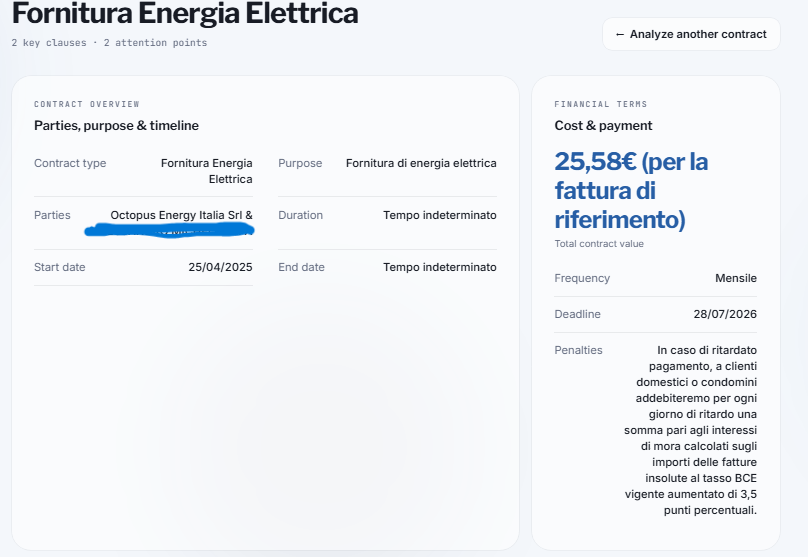
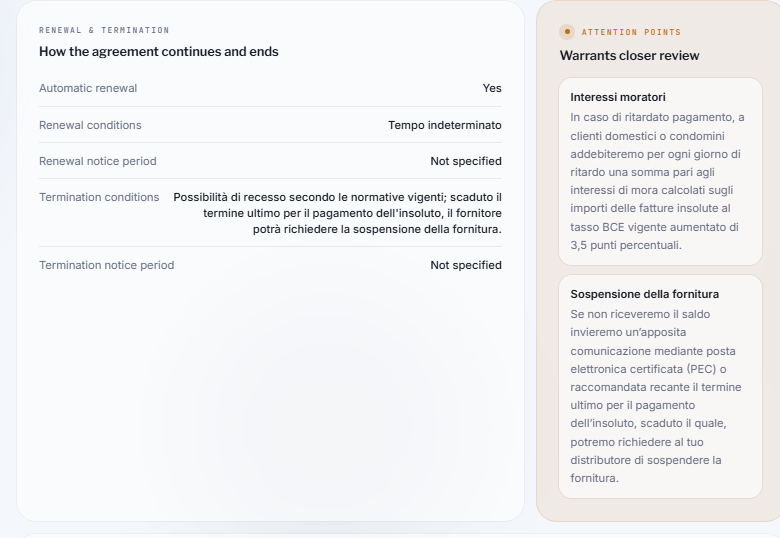
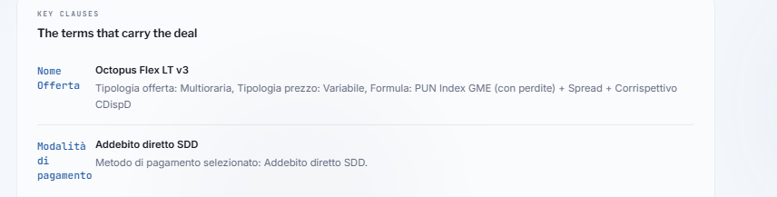

# AI Contract Analyzer

**AI-powered contract analysis MVP for structured information extraction from PDF documents**

AI Contract Analyzer is a functional prototype designed to demonstrate how Generative AI can transform unstructured contract text into a structured and easier-to-review overview.

The application combines **PDF processing, Google Gemini, structured AI output, Supabase storage and a Lovable dashboard**.

Built independently as a portfolio project to explore practical AI document analysis and reliable information extraction.

---

## 🎯 Business Problem

Reviewing contracts manually can be time-consuming.

Important information such as payment terms, duration, renewal conditions, termination clauses, penalties and obligations may be distributed across different sections of a document.

This means users often need to read and interpret an entire contract before identifying the information relevant to an initial review.

AI Contract Analyzer explores how Generative AI can reduce this manual effort by extracting and organizing key contractual information automatically.

---

## 🚀 What I Built

I designed and implemented an end-to-end AI document analysis workflow:

```text
PDF Contract
      ↓
Private Supabase Storage
      ↓
Server-Side PDF Text Extraction
      ↓
Google Gemini Analysis
      ↓
Structured JSON Output
      ↓
Results Dashboard
```

The application extracts the document text on the server and sends it to Gemini for structured factual analysis.

The AI is instructed to extract information supported by the contract rather than generate a generic summary or make unsupported assumptions.

Missing information can explicitly be returned as **"Not specified"**.

---

## ✨ Current Features

- PDF contract upload
- private document storage with Supabase
- server-side PDF text extraction
- Google Gemini API integration
- structured AI output
- contract type and parties extraction
- financial terms extraction
- start/end dates and duration
- renewal and termination conditions
- key clause extraction
- attention points
- explicit handling of missing information
- results dashboard
- basic error handling
- end-to-end testing with a real PDF contract

---

## 🧠 AI Design Principles

The project uses several principles to improve reliability:

- structured extraction instead of generic summarization
- factual extraction over unsupported interpretation
- explicit handling of missing information
- no invented contract information
- no numerical risk score
- attention points based on actual contract content
- human verification of AI-generated results

The objective is not to allow the AI to make legal decisions, but to use it as an information extraction layer inside a controlled workflow.

---

## 🛠 Tech Stack

- **Lovable** — frontend and dashboard
- **Supabase** — backend and private document storage
- **Google Gemini API** — contract analysis and structured extraction
- **Server-side PDF processing** — document text extraction
- **Structured JSON** — controlled AI output
- **GitHub** — documentation and version control

---

## 📸 Screenshots

### Contract Overview & Financial Terms



### Renewal, Termination & Attention Points



### Key Clauses



---

## 🧪 MVP Validation

The application was tested end-to-end using a real PDF contract.

The validated workflow was:

```text
PDF Upload
→ Supabase Storage
→ Text Extraction
→ Gemini Analysis
→ Structured Output
→ Results Dashboard
```

Testing verified:

- successful PDF upload
- private document storage
- PDF text extraction
- Gemini analysis
- structured output generation
- handling of missing information
- attention-point extraction
- basic error handling
- successful application build

Detailed testing documentation:

[Testing & Validation](docs/05-testing.md)

---

## 📌 MVP Scope

### Included

- PDF upload
- private document storage
- PDF text extraction
- AI-powered contract analysis
- structured output
- contract information dashboard
- attention points
- basic error handling

### Not Included

- legal advice
- automated legal decisions
- contract negotiation
- contract generation
- OCR for scanned documents
- multi-contract comparison
- collaboration features
- advanced risk scoring

---

## ⚠️ Limitations

AI Contract Analyzer is an MVP and should be considered an **analysis aid rather than a legal tool**.

AI-generated results may contain errors or misunderstandings. Relevant information should always be verified against the original contract and professional legal advice should be obtained when appropriate.

The current version works with PDFs containing extractable text and does not include OCR for scanned documents.

---

## 📚 Project Documentation

Detailed project documentation is available in the `docs` folder:

- [Problem Definition](docs/01-problem-definition.md)
- [Solution Design](docs/02-solution-design.md)
- [AI Workflow](docs/03-ai-workflow.md)
- [User Interface](docs/04-user-interface.md)
- [Testing & Validation](docs/05-testing.md)

---

## 💡 What This MVP Demonstrates

- practical Generative AI integration
- AI-assisted document analysis
- structured LLM output
- server-side AI integration
- handling of unstructured business documents
- explicit controls against unsupported AI assumptions
- backend and private file storage with Supabase
- end-to-end MVP design and validation
- documentation of AI product decisions and limitations

---

## 🔄 Possible Future Improvements

Future versions could include:

- OCR for scanned contracts
- multi-contract comparison
- clause search
- user authentication
- contract history and filtering
- human review workflow
- exportable analysis reports
- configurable extraction schemas

---

## 📖 Lessons Learned

Building an AI document-analysis workflow requires more than connecting an LLM API.

Reliable results depend on the combination of **document processing, structured prompting, controlled AI output, secure API integration, explicit handling of missing information and validation against real documents**.

The project also highlighted the importance of testing AI-generated information against the original source document rather than assuming that a technically successful AI response is necessarily accurate.
